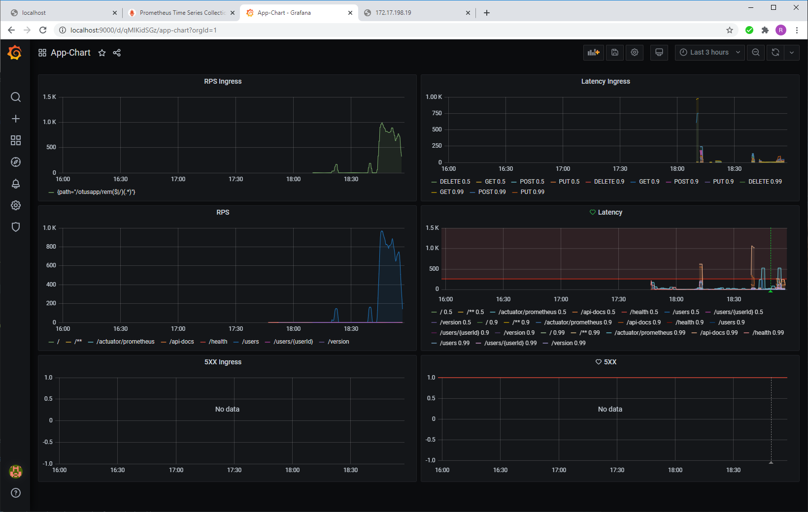

# [Архитектор ПО](https://otus.ru/lessons/arhitektor-po/)

Домашние задания по курсу Архитектор ПО

---
#### Task 01
Создание минимального сервиса для Kubernetes (minikube)
#### [Репозиторий сервиса](https://github.com/reomor/otus-arch-2020-06-rem/tree/hw01/)

[k8s/manifests](https://github.com/reomor/otus-arch-2020-06-rem/tree/hw01/docker-app/k8s) <br>
[Postman collection](https://github.com/reomor/otus-arch-2020-06-rem/tree/hw01/docker-app/postman) <br>

> k8s Deployment <br>
> k8s Service <br>
> k8s Ingress <br>

#### Task 02
RESTful CRUD для Kubernetes (minikube) и Helm
#### [Репозиторий сервиса](https://github.com/reomor/otus-arch-2020-06-rem/tree/hw02/)

[k8s/manifests](https://github.com/reomor/otus-arch-2020-06-rem/tree/hw02/docker-app/k8s) <br>
[Postman collection](https://github.com/reomor/otus-arch-2020-06-rem/tree/hw02/docker-app/postman) <br>

run order
```
helm install pg bitnami/postgresql -f docker-app/k8s/values.yaml
kubectl apply -f docker-app/k8s/config.yaml
kubectl apply -f docker-app/k8s/job.yaml
kubectl apply -f docker-app/k8s/deployment.yaml -f docker-app/k8s/service.yaml -f docker-app/k8s/ingress.yaml
newman run docker-app/postman/otus-arch-design.postman_collection.json
```
> k8s Deployment <br>
> k8s Service <br>
> k8s Ingress <br>
> k8s Job <br>
> k8s Config <br>
> Helm <br>

#### Task 03
RESTful CRUD для Kubernetes (minikube) и Helm c Prometheus и Grafana
#### [Репозиторий сервиса](https://github.com/reomor/otus-arch-2020-06-rem/tree/hw03/)

```
helm install prom stable/prometheus-operator -f ./docker-app/infra/helm/prometheus_value.yaml --atomic
helm install app-chart ./docker-app/helm/app-chart
helm install nginx stable/nginx-ingress -f ./docker-app/infra/helm/nginx-ingress.yaml
newman run docker-app/postman/otus-arch-design.postman_collection.json
```



Useful links
```
https://micrometer.io/docs/registry/prometheus
https://www.baeldung.com/micrometer
```

> k8s Ingress <br>
> Helm chart <br>
> Prometheus Operator <br>
> Prometheus <br>
> Grafana <br>

#### Task 05
Backend for frontends (BFF). API Gateway. <br>
Аутентификация и регистрация пользователей.
#### [Репозиторий сервиса](https://github.com/reomor/otus-arch-2020-06-rem/tree/hw05/)
